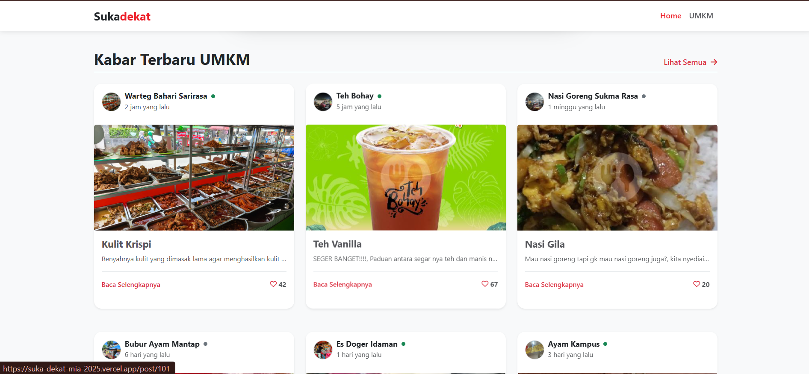
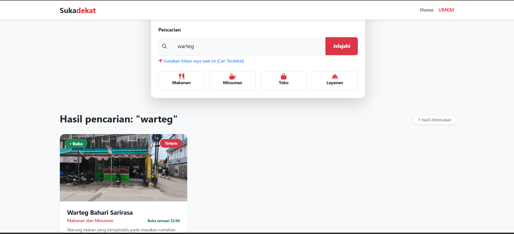
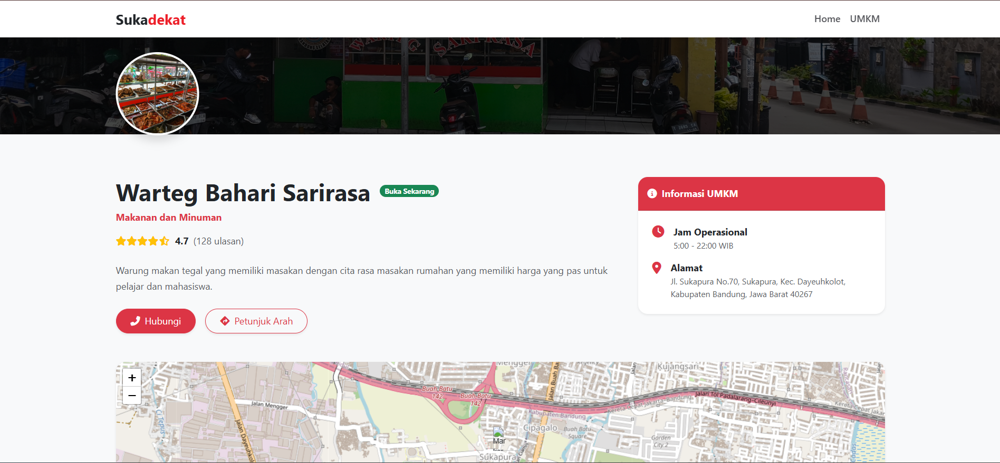
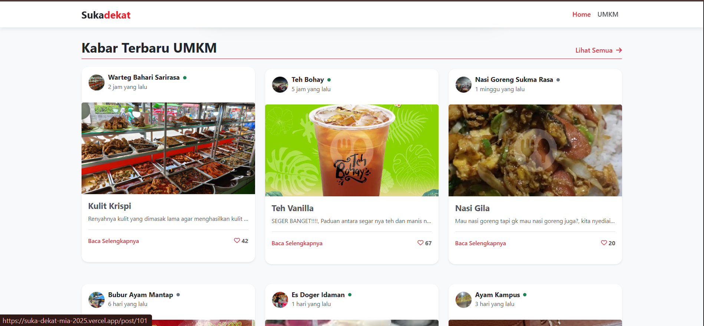

# 📍 Sukadekat - Platform Sosial & Direktori UMKM Lokal

 

> 🔗 **Live Demo:** [Klik disini untuk mencoba aplikasi](https://suka-dekat-mia-2025.vercel.app/)

**Sukadekat** adalah aplikasi web modern yang menggabungkan konsep **Direktori Pencarian** dengan antarmuka **Media Sosial** (*Social Feed*).

Berbeda dengan peta digital biasa yang informasinya sering statis dan membosankan, Sukadekat memberikan panggung bagi UMKM lokal untuk membagikan **update terkini** (seperti menu baru, promo harian, atau stok terbatas) yang akan muncul di beranda pengguna berdasarkan radius lokasi terdekat.

---

## 💡 Latar Belakang Masalah

* **Informasi Statis:** Google Maps seringkali hanya menampilkan lokasi, tapi pengguna tidak tahu apa yang *sedang* terjadi di toko tersebut (misal: Promo Jumat Berkah, Menu Baru).
* **Koneksi Terputus:** Pengguna sulit mendapatkan info *real-time* dari warung makan atau bengkel langganan mereka tanpa menyimpan nomor WA satu per satu.
* **Kurang Visual:** UMKM kecil seringkali kalah saing secara visual dibandingkan *franchise* besar di aplikasi peta konvensional.

---

## 🚀 Fitur Unggulan (Key Features)

### 1. 📱 Social Feed System (Beranda Postingan)
Halaman utama tidak hanya berisi daftar nama toko, melainkan **Feed Postingan Visual**. Pengguna dapat melihat foto produk/promo terbaru dari berbagai UMKM di sekitar mereka layaknya menggulir beranda media sosial.

### 2. 🌍 Smart Geolocation (Radius Terdekat)
Menggunakan algoritma **Haversine Formula** dan **GPS Browser** untuk memfilter konten. Postingan dan Toko yang muncul diurutkan dari jarak meter terdekat dengan posisi pengguna saat ini.

### 3. 🏪 Interactive Profile (Profil UMKM)
Halaman detail UMKM didesain menyerupai profil akun sosial media, lengkap dengan:
* **Foto Profil & Sampul.**
* **Status Operasional Real-time:** Badge "Buka" (Hijau) atau "Tutup" (Abu-abu) yang otomatis berubah mengikuti jam.
* **Galeri Postingan:** Riwayat semua update yang pernah diunggah toko.

### 4. ⚡ Direct Action
Tanpa ribet, pengguna bisa langsung melakukan aksi konversi:
* **WhatsApp Direct:** Terhubung ke pemilik toko dengan pesan template otomatis.
* **Maps Navigation:** Membuka rute jalan langsung di Google Maps.

---

## 🛠️ Teknologi (Tech Stack)

Aplikasi ini dibangun dengan ekosistem React modern untuk performa tinggi dan pengalaman pengguna yang *seamless*:

* **Core:** [React.js 18](https://react.dev/) + [Vite](https://vitejs.dev/)
* **Styling:** [Bootstrap 5](https://getbootstrap.com/) + Custom CSS (Social Card Styling)
* **Routing:** React Router DOM v6
* **Maps:** [React Leaflet](https://react-leaflet.js.org/)
* **Logic:** Geolocation API + Date Objects
* **Icons:** FontAwesome 6

---

## 📸 Galeri Aplikasi

| Social Feed (Home) | Pencarian Lokasi |
| :---: | :---: |
|  |  |

| Profil UMKM (Detail) | Detail Postingan |
| :---: | :---: |
|  |  |

*(Catatan: Gambar di atas adalah ilustrasi fitur)*

---

## 📂 Struktur Proyek

Struktur folder disusun rapi memisahkan UI (Pages/Components) dan Data:

```text
SUKADEKAT/
├── public/              # Aset statis (Gambar UMKM, Icon)
│   └── images/
├── src/
│   ├── assets/          # Global CSS
│   ├── components/      # Reusable Components (PostCard, SearchCard, Navbar)
│   ├── data/            # Dummy Database (JSON Structure with Posts Array)
│   ├── pages/           # Halaman Utama (Home, Detail, PostDetail, List)
│   ├── App.jsx          # Konfigurasi Routing
│   └── main.jsx         # Entry Point
├── package.json
└── README.md
